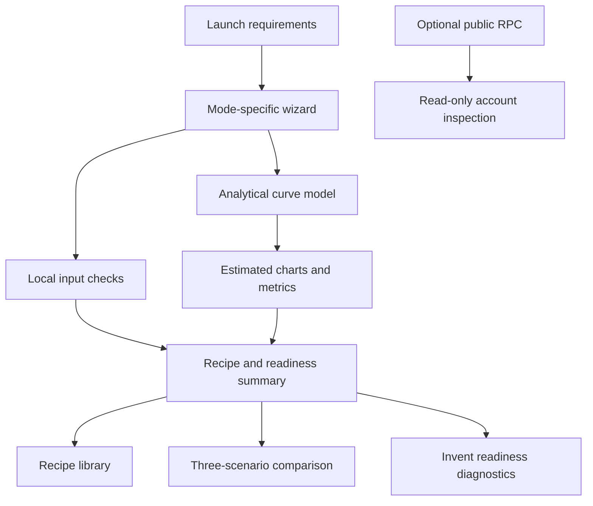

# CurveScope Architecture

CurveScope is a local-first analytical planning MVP for Meteora Dynamic Bonding Curve (DBC) launches. Its architecture separates user input, local recipe calculations, selected input checks, scenario comparison, and optional read-only account inspection.

## High-level flow

## Layers

### Domain and engine

- `src/domain/`: TypeScript models for launch requirements, recipes, validation, and derived metrics.
- `src/engine/`: floating-point curve estimates, fee arithmetic, mode-specific local checks, and qualitative trade-off explanations.
- Curve visualizations are analytical estimates. They do not claim exact SDK rounding, protocol parity, or on-chain simulation.

### Meteora and Solana adapters

- `src/adapters/meteora/inventSerializer.ts`: readiness diagnostics and report formatting. It does not generate a complete validated Invent configuration; export remains disabled.
- `src/adapters/solana/readOnlyClient.ts`: optional read-only RPC account inspection using Solana web3.js and the installed Meteora DBC SDK. Provider availability and rate limits are outside the app's control.

### Data and UI

- `src/data/recipeFactory.ts`: constructs a recipe from user requirements.
- `src/data/exampleRecipes.ts`: illustrative examples, not endorsed or optimized configurations.
- `src/pages/` and `src/components/`: React UI, charts, wizard, library, readiness diagnostics, and comparison views.
- User-created recipe persistence is client-side.

## Execution boundaries

1. A user enters launch requirements in the wizard.
2. The recipe factory calculates analytical metrics and visual segments.
3. Local validation and selected installed-SDK helper checks evaluate supported inputs. These checks do not constitute full protocol or Invent configuration validation.
4. The user inspects charts, assumptions, and qualitative parameter differences.
5. The user compares three recipes and reviews readiness diagnostics.
6. Optional account inspection can make read-only RPC requests. It is not required for the core planning workflow.

## Explicit non-goals

- No wallet connection, signing, transaction submission, or deployment.
- No complete Invent JSONC serializer, official parser acceptance, or executable Invent config export.
- No claim that analytical charts match SDK or on-chain output.
- No composite score, profitability forecast, or guaranteed graduation outcome.
